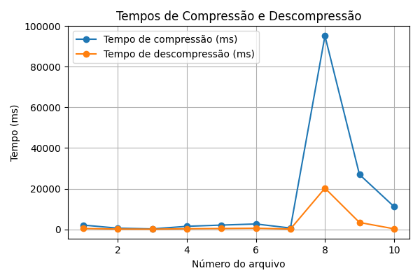
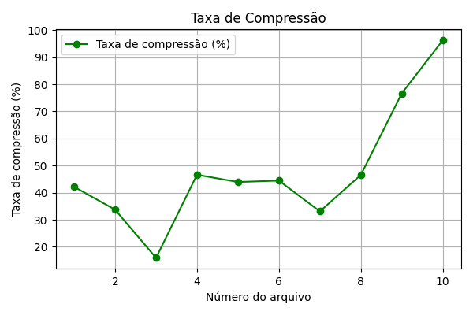

## Introdução

**Grupo:** Philipe e Salvador

**Repositório:** http://github.com/philipedc/lzw

O TP1 de Algoritmos II consiste em criar um algortimo para compressão e descompressão de arquivos usando o LZW. A primeira observação é que o algoritmo aceita uma sequência strings de bits qualquer, logo pode ser usado para qualquer tipo de arquivo.

A Trie (ou Árvore de Prefixos) é uma estrutura de dados eficiente para armazenar strings e realizar operações como inserções, buscas e remoções. Sua principal vantagem é a capacidade de armazenar strings de forma compacta e otimizada, tornando-a ideal para aplicações de prefix matching (como demonstrado em sala de aula) e sistemas de recomendação baseados em prefixos. As operações de inserção, busca e remoção na Trie têm complexidade O(n), onde n é o tamanho da string envolvida, já que é necessário percorrer os caracteres da string na árvore.

## Detalhes de Implementação:

Para otimizar o uso de memória, implementamos uma Trie compacta, ou seja, buscamos armazenar o máximo possível de caracteres em cada nó, evitando a criação de nós desnecessários.

Um dos principais desafios na implementação dessa estrutura foi adaptá-la para apoiar o algoritmo LZW (Lempel-Ziv-Welch). Especificamente, a Trie precisava ser capaz de realizar buscas tanto por chave quanto por valor (isto é, tree[key] = value ou tree[value] = key). Para resolver esse problema, criamos duas árvores: uma armazenando as chaves e outra armazenando os valores invertidos (onde cada valor é a chave na segunda árvore). Isso permite realizar buscas eficientes tanto por chave quanto por valor.

## Modo de Uso

### As funções LZW podem ser testadas de forma individual:

**LZW Fixo:** `python3 Main_Fixo.py arquivo arquivo_comprimido arquivo_descomprimido`

**LZW Variável:** `python3 Main_Variavel.py arquivo arquivo_comprimido arquivo_descomprimido --tam_max_dic {tamanho}`

### LZW em todos os samples ao mesmo tempo:

Execute `python3 run_all.py` os resultados aparecerão em outputs/

## Benchmark/Testes

A única célula do jupyter **generate_graph.ipynb** utiliza os dados gerados pelo **run_all.py** e gera os dados a seguir:

Além disso, testes foram desenvolvidos para garantir que a Trie funcione corretamente após cada modificação. Os testes podem ser executados com o comando: `python3 test_tree.py`.
